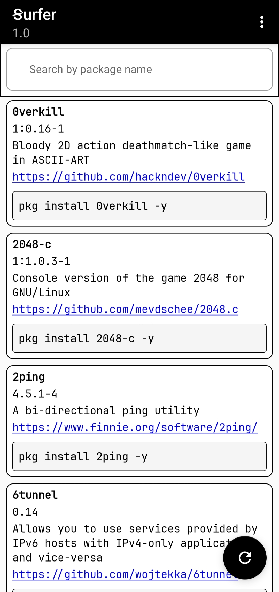

# Ꞩurfer
The **Ꞩurfer** app allows you to browse the list of packages available in the [Termux packages](https://github.com/termux/termux-packages) repository, including the package name, version, short description, and homepage.

You can also search for any package and copy its installation command `pkg install <package> -y`.  

The package list is automatically updated every 2 to 3 hours.

[Download](https://github.com/haithamaouati/Surfer/releases/download/1.0/Surfer_release.apk)

## Screenshot

